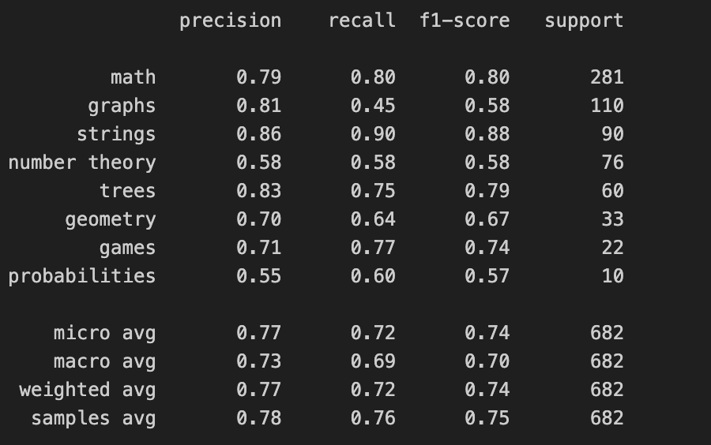
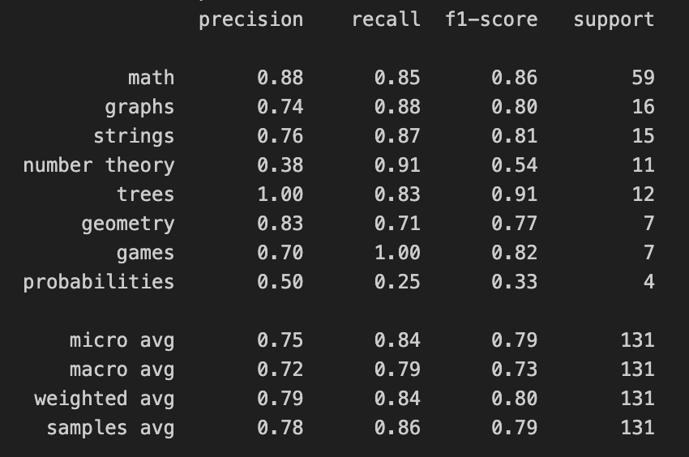

# 🏷️ Algorithmic Problem Classification

## 📖 Context & Objective

**Context** Coding platforms like Codeforces host thousands of algorithmic problems. Accurately categorizing these problems (e.g., "Dynamic Programming", "Graphs", "Number Theory") is crucial for user experience and content recommendation. The **xCodeEval** dataset provides problem descriptions, input/output specifications, and user-submitted solutions in Python.

**Objective** Develop an algorithm to predict tags for a given exercise using its **Description** and **Source Code**.  
* **Scope:** Focus on 8 specific tags: `['math', 'graphs', 'strings', 'number theory', 'trees', 'geometry', 'games', 'probabilities']`.
* **Metrics:** Given the multi-label nature and class imbalance, we evaluate using **Micro F1-Score** (global performance) and **Macro F1-Score** (performance across minority classes).

---

## ⚙️ Data Preprocessing

The raw dataset consists of JSON files containing problem metadata and solution code. The preprocessing pipeline (`src/processing.py`) transforms this into a usable format:

1.  **Feature Engineering:**
    * **`full_description`:** Concatenation of Problem Statement, Input/Output specs, and Notes to capture full context.
    * **`source_code`:** Validated Python solutions provided by users.
2.  **Target Filtering:**
    * Filtered tags to keep only the 8 target categories.
    * Removed samples with no relevant tags.
3.  **Cleaning:**
    * Language detection (removed non-English samples).
    * Dropped irrelevant metadata (time limits, creation dates).

**Output:** A structured JSONL dataset with text features and a multi-label target vector.

---

## 🧠 Modeling Approaches

We explored three distinct paradigms to solve this problem, ranging from efficient ML baselines to state-of-the-art LLMs.

### 1. Classical Machine Learning (The "Industrial" Choice)
* **Method:** TF-IDF Vectorization + Gradient Boosting.
* **Details:**
    * Concatenated description and code into a single text corpus.
    * **Best Model:** **LightGBM** wrapped in a `OneVsRestClassifier`.
    * **Optimization:** Hyperparameters tuned via **Optuna**. Used `class_weight='balanced'` to handle minority tags.
* **Pros:** Extremely fast training/inference (<10ms/sample), low resource footprint, high interpretability via SHAP.
* **Cons:** Ignores semantic word order.


#### Results :


### 2. Deep Learning (Transfer Learning)
* **Method:** Multi-modal Transformer Architecture.
* **Details:**
    * **Description Encoder:** `distilbert-base-uncased` (captures natural language nuances).
    * **Code Encoder:** `microsoft/codebert-base` (pretrained specifically on code).
    * **Architecture:** The embeddings from both models are concatenated and passed through a custom classification head.
* **Pros:** Captures deep semantic relationships and interactions between code logic and problem text.
* **Cons:** High computational cost (GPU required), complex deployment.

#### Results :



### 3. Large Language Models (The SOTA Choice)
* **Method:** Zero-shot Inference with Mistral AI.
* **Details:**
    * Used `codestral-latest` via API.
    * Prompt engineering to enforce JSON output restricted to the specific tag list.
* **Pros:** Outperforms all other methods, requires no training data, understands complex reasoning.
* **Cons:** High inference latency (~2s) and API costs.

#### Results :



---
## 📊 Results & Comparison

We observed a clear hierarchy in performance across the three approaches.

| Approach              | Micro F1-Score | Macro F1-Score | Training Time | Inference Speed |
|----------------------|:--------------:|:--------------:|:--------------|:----------------|
| **TF-IDF + LightGBM** | **0.75**       | **0.74**       | Fast (<1min)  | **Very Fast**      |
| **Multi-Encoder DL**  | 0.74           | 0.70           | Slow (GPU)    | **Mid**         |
| **LLM (Codestral)**   | **0.79**       | **0.73**       | N/A           | **Slow**           |

**Key Takeaways:**

1. **Classical ML is surprisingly robust:**  
   It matches the complex Deep Learning approach while being significantly lighter.  
   **This is the chosen model for the production CLI.**

2. **LLMs are superior:**  
   With zero training, Codestral achieves the best results, demonstrating strong reasoning capabilities on code tasks.


------------------------------------------------------------------------

## 🚀 Usage

The project is structured to be executed via CLI.

### 1. Dependencies

``` bash
pip install -r requirements.txt
# Ensure MISTRAL_API_KEY is set in env variables if using LLM scripts
```

### 2. Preprocessing

Convert raw JSON files into the clean dataset.

``` bash
python src/processing.py --input "data/raw/code_classification_dataset/" --output "data/processed/cleaned.jsonl" --label
```

### 3. Training (ML Approach)

Train the TF-IDF + LightGBM pipeline and save the artifact.

``` bash
python train.py --data_path "data/processed/cleaned.jsonl" --output_model_name "tfidf_lgbm_full_model.joblib"
```

### 4. Prediction

Predict tags for a new dataset using the saved model.

``` bash
python ml_predict.py --input "data/test_data.jsonl" --model "models/tfidf_lgbm_full_model.joblib"
```

------------------------------------------------------------------------

## 🔮 Future Improvements

-   **LLM Fine-tuning:** Fine-tuning a smaller LLM (e.g., Mistral-7B or
    Llama-3-8B) on this dataset could yield SOTA performance with lower
    latency than API calls.
-   **Data Augmentation:** The Deep Learning approach suffered from data
    scarcity. Back-translation or LLM-generated variations could improve
    generalization.
-   **Hierarchical Classification:** Some tags are correlated (e.g.,
    *trees* implies *graphs*). A hierarchical model could leverage these
    dependencies.
